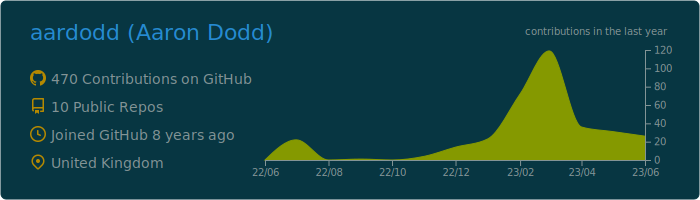
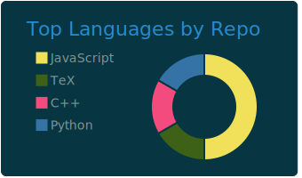
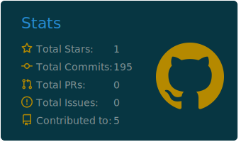

### Hello, World!

You've stumbled across my github profile! I'm **Aaron Dodd**, a passionate self-taught full stack software engineer with 5 years (and counting!) industry experience who loves solving difficult problems with computers.

Throughout my career I've had the opportunity to work alongside senior software engineers who have raised my standards of what's expected from any software engineer, and have given me the opportunity to further my studies. I now hold a Bachelors Degree in Computer Science from the University of Hertfordshire.

### Stats

 

